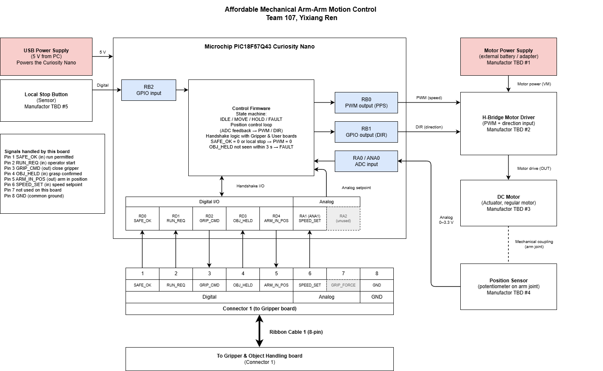

## Overview
This block diagram is to show the subsystems of the Arm Motion Control board, how power and signals flow between them, and how the board connects to the rest of the team. The board runs on a PIC18F57Q43 Curiosity Nano, powered by a 5 V USB supply, with 3.3 V logic and a 0–3.3 V analog range. The actuator is a regular DC motor driven by an H-bridge, which is powered by a separate external supply at 5V so that motor current does not pass through the microcontroller board. The sensor is a potentiometer on the arm joint (0–3.3 V analog output), and a local stop button provides a second stop input. The board connects to the Gripper & Object Handling board through an 8-pin ribbon cable: it receives SAFE_OK, RUN_REQ, OBJ_HELD and SPEED_SET, and sends GRIP_CMD and ARM_IN_POS. All grounds, which including USB, motor supply, H-bridge and ribbon pin 8 are tied together. 

## Block Diagram 

